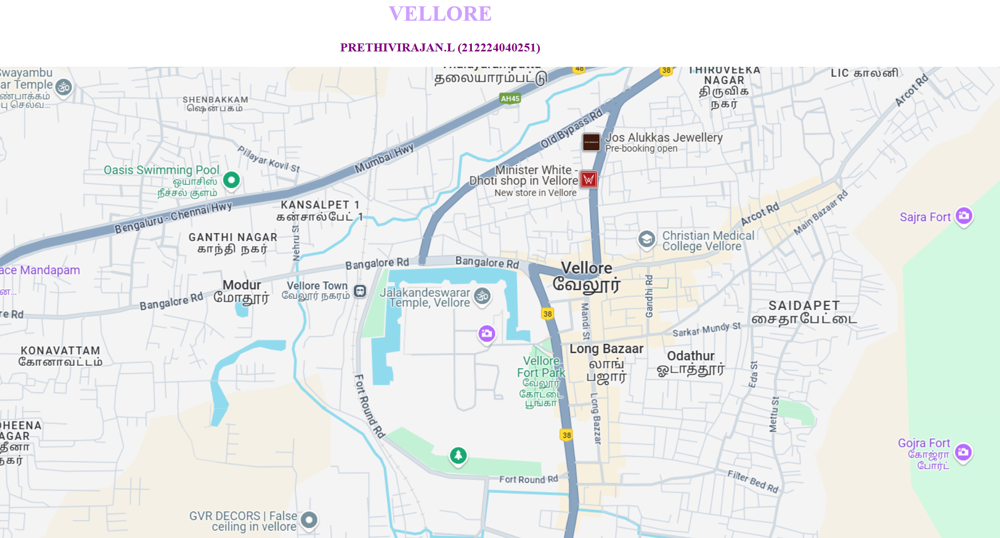

# Ex04 Places Around Me
## Date: 22.04.2025

## AIM
To develop a website to display details about the places around my house.

## DESIGN STEPS

### STEP 1
Create a Django admin interface.

### STEP 2
Download your city map from Google.

### STEP 3
Using ```<map>``` tag name the map.

### STEP 4
Create clickable regions in the image using ```<area>``` tag.

### STEP 5
Write HTML programs for all the regions identified.

### STEP 6
Execute the programs and publish them.

## CODE
## map.html
```html
<html>
<head>
<title>My City</title>
</head>
<body>
<h1 align="center">
<font color="CF9FFF"><b>VELLORE</b></font>
</h1>
<h3 align="center">
<font color="purple"><b>PRETHIVIRAJAN.L (212224040251)</b></font>
</h3>
<center>
    

<map name="image-map">
    <area target="" alt="cmchospital" title="cmchospital" href="cmc.html" coords="1065,262,70" shape="circle">
    <area target="" alt="temple" title="temple" href="temple.html" coords="813,349,71" shape="circle">
    <area target="" alt="fortpark" title="fortpark" href="park.html" coords="904,481,68" shape="circle">
    <area target="" alt="josallukas" title="josallukas" href="josallukas.html" coords="975,114,56" shape="circle">
    <area target="" alt="gojrafort" title="gojrafort" href="gojra.html" coords="1537,583,76" shape="circle">
</map>

</center>
</body>
</html>
```
## cmc.html
```html
<html>
<body bgcolor="lightblue">
    <h1 align="center">
        <font  size="10" color="black">
            CMC MEDICAL COLLEGE
        </font>
    </h1>
    <h2 align="center">
        <font color="black">
            A Leading medical research, education, and healthcare institution in India
        </font>
    </h2>
    <hr>
    <h3>
        <center> 
        
        </center>
        <br>
        <hr>
        <li>
            <font size="4">
                Christian Medical College (CMC) Vellore is widely regarded as one of the top medical institutions in India, known for its academic excellence, strong clinical training, and deep-rooted values of service. It consistently ranks among the best medical colleges in the country, attracting students from across India due to its rigorous curriculum and outstanding faculty. One of its most notable strengths is the vast clinical exposure it offers—students at CMC Vellore have the opportunity to work with a high patient load from diverse backgrounds, allowing them to gain hands-on experience with a wide variety of medical conditions early in their training. The college is also known for its strong emphasis on community healthcare and serving underprivileged populations, reflecting its Christian mission of compassionate service. Located in the town of Vellore in Tamil Nadu, the campus fosters a close-knit, purpose-driven student community. Though the academic workload can be intense, the environment encourages strong peer support and holistic development. CMC Vellore alumni are highly respected both in India and internationally, with many going on to pursue further studies or successful careers abroad. Overall, CMC Vellore stands out not just as a center of medical education, but as an institution that shapes skilled, ethical, and socially responsible doctors.
            </font>
        </li>
    </h3>
</body>

</html>
```
## josallukas.html
```html
<html>
<body bgcolor="#D8B2D1">
    <h1 align="center">
        <font  size="10" color="black">
            JOS ALUKKAS JEWELLERY
        </font>
    </h1>
    <h2 align="center">
        <font color="black">
            Jos Alukkas Vellore: Timeless Jewellery, Trusted Legacy
        </font>
    </h2>
    <hr>
    <h3>
        <center> 
        
        </center>
        <br>
        <hr>
        <li>
            <font size="4">
                Jos Alukkas Jewellery in Vellore is a prominent destination for gold, diamond, and platinum jewellery lovers in the region. Part of the renowned Jos Alukkas group, which has a legacy of trust and excellence in the jewellery industry, the Vellore showroom reflects the brand's commitment to quality, craftsmanship, and customer satisfaction.

                Located in a convenient and easily accessible area of the city, the showroom offers a luxurious shopping experience with a wide array of traditional, contemporary, and designer collections. Whether it’s bridal jewellery, daily wear, or custom-crafted pieces, Jos Alukkas in Vellore caters to a wide range of tastes and budgets. The staff is known for their friendly service and attention to detail, helping customers find the perfect piece for every occasion.
                
                Backed by BIS-certified gold and transparent pricing, the showroom emphasizes purity and value, making it a trusted choice for generations of families. With seasonal offers, festive collections, and modern facilities, Jos Alukkas continues to be a shining name in Vellore’s jewellery landscape.

               
        </li>
    </h3>
</body>

</html>
```
## temple.html
```html
<html>
<body bgcolor="#ff6666">
    <h1 align="center">
        <font  size="10" color="black">
            JALAKANDESHWARAR TEMPLE
        </font>
    </h1>
    <h2 align="center">
        <font color="black">
            Jalakandeswarar Temple: A Sacred Gem in the Heart of Vellore
        </font>
    </h2>
    <hr>
    <h3>
        <center> 
        
        </center>
        <br>
        <hr>
        <li>
            <font size="4">
                The Jalakandeswarar Temple is a beautiful and historically significant temple located within the Vellore Fort complex in Vellore, Tamil Nadu. Dedicated to Lord Shiva, worshipped here as Jalakandeswarar (meaning “Lord of the Water”), the temple is a striking example of Dravidian architecture. It was built during the Vijayanagara period in the 16th century, and its intricate carvings, towering gopuram (gateway tower), and stone sculptures reflect the rich artistic heritage of that era.

                One of the unique features of the temple is that it is situated at a lower level than the surrounding moat, which is believed to have once filled with water—hence the name Jalakandeswarar. The sanctum sanctorum (garbhagriha) houses a majestic Shiva lingam, and the temple is adorned with detailed carvings of gods, goddesses, dancers, and mythical creatures.
                
                The temple is not only a place of worship but also a cultural landmark. It remained closed for many years during colonial times but was reopened to the public in the 1980s after efforts by local communities. Today, it is an active place of devotion and draws both pilgrims and tourists for its spiritual ambiance and architectural grandeur.
                
                The temple stands as a testament to the religious, artistic, and historical legacy of South India, making it a must-visit spot for anyone traveling to Vellore.
        </li>
    </h3>
</body>

</html>
```
## gojra.html
```html
<html>
<body bgcolor="#FFA07A">
    <h1 align="center">
        <font  size="10" color="black">
            GOJRA FORT
        </font>
    </h1>
    <h2 align="center">
        <font color="black">
            Gojra Fort: A Historic Marvel of Timeless Beauty
        </font>
    </h2>
    <hr>
    <h3>
        <center> 
        
        </center>
        <br>
        <hr>
        <li>
            <font size="4">
                Gojra Fort is a historical site located atop the Naammam Malai hill, east of Vellore city in Tamil Nadu. Built during the Maratha Empire in 1678, the fort played a crucial role during the Maratha siege of Vellore Fort. It was one of two forts constructed by Chhatrapati Shivaji’s forces, with the nearby Sajra Fort also contributing to the siege efforts. Strategically placed around 2 km from Vellore Fort, Gojra Fort's elevated position allowed it to oversee and control the surrounding area, playing a significant role in the bombardment of the lower Vellore Fort.

Today, Gojra Fort remains a testament to the military history of the region. Visitors can explore its remnants, including stone walls and other structures, which offer a glimpse into the architectural and strategic designs of the time. The fort’s location provides panoramic views of the surrounding landscape, making it an attractive destination for both history enthusiasts and nature lovers. While it may not be as widely visited as other historic forts, Gojra Fort holds an important place in the historical narrative of Vellore.

               
        </li>
    </h3>
</body>

</html>
```


## OUTPUT



## RESULT
The program for implementing image maps using HTML is executed successfully.
